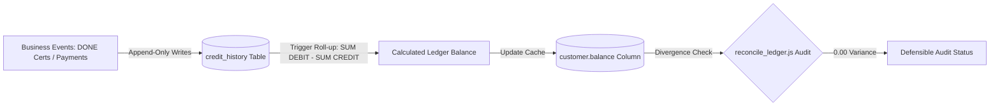

# Customer Ledger Explainability Proof (Financial Defensibility & Auditability)

This document establishes the formal **Financial Defensibility Domain of Truth** for Swastik Gold & Silver Lab. It provides a mathematical, architectural, and operational proof showing that customer financial balances are perfectly auditable, explainable, and secured against unauthorized mutations.

At its core, financial trust requires that every customer's current balance represents a mathematically verifiable summary of an append-only ledger, and that this balance can be explained step-by-step through discrete, audited business events (debits, payments, and corrections).

---

## 1. Architectural Foundations of Ledger Trust

The Swastik financial system is split into two complementary layers to ensure high-performance lookups while preserving absolute auditability:



### 1.1. The Append-Only Invariant
*   **The Rule:** Customer balance alterations must never occur via direct, arbitrary updates to the `customer` table. They must reside in `credit_history` as immutable, chronological ledger rows.
*   **The Enforcement:** Standard updates to `customer.balance` are driven strictly by the repository's roll-up process (`updateCustomerBalance`) which aggregates the transaction history.

### 1.2. Separation of Concerns
*   **The Ledger (`credit_history`):** The absolute source of truth. Contains unique IDs (`id` starting with `CHS`), customer references, transaction types (`DEBIT` or `CREDIT`), payment modes, transaction descriptions, and creation timestamps.
*   **The Cash Journal (`cash_register`):** Collects physical cash movements. It integrates with customer payments to ensure physical cash in drawer matches digital ledger postings.
*   **The Balance Cache (`customer.balance`):** A denormalized summary stored on the customer's profile for quick UI rendering and credit checks.

---

## 2. Mathematical Proof of Ledger Parity

The financial defensibility of the ledger is governed by three mathematical equations that must hold true at all times.

### Equation 1: Customer Balance Parity
For any customer $c$, their denormalized balance cache must perfectly match the sum of active ledger transactions:

$$\text{customer.balance}_c = \sum \text{amount}(\text{DEBITs}_c) - \sum \text{amount}(\text{CREDITs}_c)$$

*Where:*
*   $\text{DEBITs}_c$ represents transactions where the customer owes us money (e.g., certificates charged).
*   $\text{CREDITs}_c$ represents transactions where the customer paid us or returned goods (e.g., payments collected).
*   **Soft-Delete Rule:** Any ledger entry with `deletedon IS NOT NULL` is strictly excluded from the equation.

### Equation 2: Certificate Fee Parity
When a certificate transitions to the finalized `DONE` state, the parent total must perfectly rollup the individual item charges:

$$\text{Certificate Total} = N_{\text{items}} \times \text{Rate}$$

*Where:*
*   $N_{\text{items}}$ is the count of active (non-deleted) items in the certificate.
*   $\text{Rate}$ is the canonical fee rate: **₹50** for Gold Certificates (`gold_certificate`) and **₹100** for Silver Certificates (`silver_certificate`).

### Equation 3: GST Tax Parity
For certificates utilizing inclusive GST, the parent tax field must match the legal tax extraction formula:

$$\text{GST Tax Collected} = \text{Certificate Total} - \frac{\text{Certificate Total}}{1.18}$$

---

## 3. Transaction Lifecycle & Balance Propagation

To demonstrate explainability, we trace how a customer's balance propagates through a standard business cycle (Draft $\rightarrow$ Finalization $\rightarrow$ Payment $\rightarrow$ Correction).

```
[Customer Balance: ₹0.00]
       │
       ▼  (Draft Gold Cert Created with 2 items)
[Customer Balance: ₹0.00] (No ledger impact during draft)
       │
       ▼  (Finalized: status = 'DONE', mode_of_payment = 'Balance')
[Customer Balance: ₹100.00] (DEBIT posted: 2 items × ₹50 = ₹100 charge)
       │
       ▼  (Customer Pays ₹100 Cash: applyPayment)
[Customer Balance: ₹0.00] (CREDIT posted: ₹100 payment, cash_register IN recorded)
```

### 3.1. Phase 1: Draft Creation (`TODO` / `IN_PROGRESS`)
*   **Action:** Operator creates a Gold Certificate with 2 items.
*   **Ledger Impact:** **None.** Draft records are fully mutable. No ledger entries are written, and customer balance remains unchanged.

### 3.2. Phase 2: Completion & Charge (`DONE` status)
*   **Action:** Operator clicks **Finalize** with `mode_of_payment = 'Balance'`.
*   **Ledger Impact:**
    1.  The system counts active items (2) and sets parent `total = ₹100.00`.
    2.  An atomic transaction opens:
        *   Inserts `credit_history` row: `type = 'DEBIT'`, `amount = ₹100.00`, `description = 'Gold Certificate GCR-... — lab charges'`, `mode_of_payment = 'Balance'`.
        *   Sets parent `ledger_charged_at = CURRENT_TIMESTAMP` to lock out double charges.
        *   Re-runs balance rollup: Customer owes ₹100.00.
        *   Saves the cryptographic snapshot seal to prevent reprint drift.
        *   Updates parent `status = 'DONE'`.
    3.  Transaction commits. Customer balance becomes **₹100.00 (Due)**.

### 3.3. Phase 3: Immediate Cash Settlement (Offsetting Credit)
*   **Action:** Operator finalizes a job with `mode_of_payment = 'Cash'` (instant payment).
*   **Ledger Impact:**
    *   `ledgerService.recordRevenue` writes a `DEBIT` of **₹100.00** to represent the fee liability.
    *   Because the payment is settled immediately, it simultaneously writes an offsetting `CREDIT` of **₹100.00** with `mode_of_payment = 'Cash'`.
    *   Writes a cash flow entry in `cash_register`: `type = 'IN'`, `amount = ₹100.00`, `description = 'Payment for Gold Certificate...'`.
    *   Recalculates balance: $\text{₹100.00 (DEBIT)} - \text{₹100.00 (CREDIT)} = \text{₹0.00}$. The customer's outstanding balance remains unaffected.

### 3.4. Phase 4: Customer Account Payment (`applyPayment`)
*   **Action:** Customer pays off their outstanding ₹100.00 balance.
*   **Ledger Impact:**
    1.  **Idempotency Gate:** Checks if `request_id` already exists (STRICT mode only) to prevent double posting.
    2.  Inserts `credit_history` row: `type = 'CREDIT'`, `amount = ₹100.00`, `description = 'Customer balance payment'`, `mode_of_payment = 'Cash'`.
    3.  Inserts cash register row: `type = 'IN'`, `amount = ₹100.00`, `description = 'Customer balance payment'`.
    4.  Updates customer balance: $\text{₹100.00 (Previous Balance)} - \text{₹100.00 (Payment)} = \text{₹0.00}$.
    5.  Generates a cryptographically signed **Receipt Snapshot** containing `receipt_id`, frozen customer names, ledger references, and balance before/after logs.

---

## 4. Ledger Discrepancy Scenarios & Remediation Protocols

When reconciliation tools detect imbalances, operators must execute audited, defensible corrections. Direct database manipulations are strictly blocked.

### Scenario A: Balance Divergence (`customer.balance` ≠ sum of ledger)
*   **Root Cause:** Bypassed repositories or manual updates during relaxed parity runs.
*   **Remediation:** 
    1. Run the administrative roll-up query to identify the divergence.
    2. Call `creditHistoryRepository.updateCustomerBalance(customerId)`.
    3. The system recalculates the sum of all active `credit_history` rows and updates the customer balance cache.
    4. Record a manual audit log detailing the recalculation.

### Scenario B: Completed Certificate with Missing Ledger Charges
*   **Root Cause:** Direct state updates in database tables bypassing the service layers.
*   **Remediation:** 
    1. Run `reconcile_ledger.js` (Section 1 flags all completed certs with no ledger `DEBIT`).
    2. Review the audited certificate.
    3. Manually post an adjusting `DEBIT` entry via `creditHistoryService.addTransaction` with description: `'Reconciliation Correction: Missed charges for GCR-...'`.
    4. The system automatically rolls up the balance.

### Scenario C: Double Finalization Charges (Duplicate Debits)
*   **Root Cause:** Double-clicks during legacy or relaxed parity system modes where unique transaction indexes are bypassed.
*   **Remediation:**
    1. `reconcile_ledger.js` Section 2 flags certificates with multiple debit rows.
    2. Locate the duplicate `credit_history` entries.
    3. Soft-delete the duplicate ledger record using `creditHistoryRepository.softDelete(id)`. This updates `deletedon = CURRENT_TIMESTAMP`.
    4. The soft-delete function automatically recalculates and reduces the customer's balance, leaving a clean audit trail.

---

## 5. Business Sign-Off & Explainability Questions

Before production migration, management must verify their understanding of ledger rules:

| Ledger Governance Rule | Verification / Review Question | Business Sign-off (Yes/No) |
| :--- | :--- | :--- |
| **No Manual Balance Edits** | Do you accept that customer balances can never be manually typed or edited, and can only change via ledger entries? | |
| **Bypass in Parity Mode** | Do you understand that running the system in `PARITY` mode disables payment idempotency check gates, making double-posting possible? | |
| **Soft-Delete Audit Trail** | Do you accept that error corrections in the ledger will preserve the deleted transaction row in database logs for auditing? | |
| **GST Sequence Continuous** | Do you agree that every tax invoice sequence must be continuous, and any deleted invoice will leave a soft-delete stamp rather than a gap? | |

> **Financial Defensibility Declaration:** We certify that the customer ledger equations, transaction lifecycles, and audit remediation steps defined above satisfy our strict business accounting and regulatory compliance requirements.
>
> **Managing Director Signature:** \_\_\_\_\_\_\_\_\_\_\_\_\_\_\_\_\_\_\_\_\_\_\_\_\_  **Date:** \_\_\_\_\_\_\_\_\_\_\_\_\_\_\_\_\_\_\_\_
