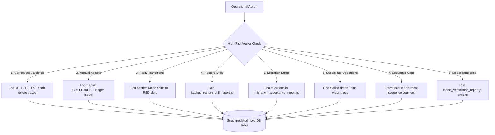

# Management Observability Governance (Governance Visibility Truth)

This policy establishes the **Governance Visibility Domain of Truth** for Swastik Gold & Silver Lab. It provides the definitive administrative framework, telemetry mappings, exception triggers, and weekly audit protocols designed to answer the ultimate question of executive oversight:

> **“Can leadership see when institutional truth is at risk?”**

Observability is not simple log inspection or database checking. It is the active, structured visibility that guarantees anomalies, system overrides, manual financial edits, state-machine violations, and data deletes are immediately captured, structured, and presented to leadership for review. 

---

## 1. The Eight High-Risk Activity Vectors

To guarantee that management has total visibility over operational risks, the observability system actively tracks, logs, and audits **Eight High-Risk Activity Vectors**. Every occurrence in these vectors generates structured telemetry via `writeAuditLog` and is compiled into executive audit dashboards.



### 1.1. Correction Visibility (Soft-Deletes & Re-Creations)
*   **The Risk:** Operators soft-deleting completed tests or certificates to hide clerical mistakes, alter historic weights, or erase audit trails.
*   **The Telemetry:**
    *   Actions: `DELETE_TEST`, `DELETE_CERTIFICATE`, `DELETE_CERT_ITEM`, or `softDelete` updates to `credit_history`.
    *   Log Fields: Records the `old_value` (original data snapshot) and `new_value` (soft-deleted state stamp), along with the operator's ID.
*   **Observability View:** Dashboards must maintain a chronological count of soft-deletions, with direct links from the deleted record to the replacement record ID.

### 1.2. Override and Manual Ledger Adjustments
*   **The Risk:** Posting manual credits or debits directly to customer balances without a linked certificate, potentially bypassing standard fee models or enabling unauthorized discounts.
*   **The Telemetry:**
    *   Actions: Manual postings via `creditHistoryService.addTransaction`.
    *   Log Fields: Must include `user_id`, `amount`, `mode_of_payment`, and a mandatory, audited `description` field containing the adjustment justification.
*   **Observability View:** Flags any manual ledger adjustments that are not associated with a valid, system-generated certificate reference (`reference_type` and `reference_id` are null).

### 1.3. Mode Parity Transitions (System Mode Alterations)
*   **The Risk:** Switching the system from `STRICT` mode to Python-compatible `PARITY` mode, which relaxes validation check gates, disables payment idempotency guards, and opens the system to duplicate posting vulnerabilities.
*   **The Telemetry:**
    *   Actions: Configuration shifts in `configService.js` or modifications to the `SYSTEM_MODE` runtime environment.
    *   Log Fields: Logs the transitioning actor, the old mode, the new mode, and the active session trace.
*   **Observability View:** Parity-mode execution periods are highlighted in red on all audit logs to indicate a relaxed-security operating state.

### 1.4. Restore and Database Rebuild Events
*   **The Risk:** Restoring a database backup to revert transactions, wipe out customer dues, or cover financial discrepancies.
*   **The Telemetry:**
    *   Actions: Executing database recovery operations (audited via `backup_restore_drill_report.js`).
    *   Log Fields: Records the restore timestamp, backup source version, target schema version, and balance-integrity summaries before and after restoration.
*   **Observability View:** Any database restore triggers an automatic email alert to management and locks further transactions until the administrator runs `reconcile_ledger.js` and signs off.

### 1.5. Failed Migration and Legacy Acceptance Errors
*   **The Risk:** Stale, incomplete, or structurally inconsistent legacy records from the old Python system corrupting the active database during migration.
*   **The Telemetry:**
    *   Actions: Data parsing anomalies captured during legacy imports (audited via `migrate_from_python.js`).
    *   Log Fields: Records parsing failures, unrecognized status strings, missing weights, and mismatched balances.
*   **Observability View:** Summarized in the `migration_acceptance_report.js`. Any reject count $>0$ halts the production migration pipeline.

### 1.6. Suspicious Operational Behavior (Stalls & High Variances)
*   **The Risk:** Drafts kept in `IN_PROGRESS` status for days to hide pending payouts, or high-variance testing losses signifying gold theft or refinery leakage.
*   **The Telemetry:**
    *   Draft Stalls: Stalled drafts in `IN_PROGRESS` for $>24$ hours are automatically queried by `reconcile_ledger.js`.
    *   Weight-Loss Anomalies: Gold testing weight-loss records (`weight_loss_history`) exceeding a **1.0g** variance on a single test.
*   **Observability View:** Highlighted as "High-Severity Warnings" requiring manual manager resolution.

### 1.7. Sequence Gaps and Database Tampering
*   **The Risk:** Direct SQL deletions executing behind the application boundary, leaving sequential gaps in customer bills.
*   **The Telemetry:**
    *   Actions: Daily gaps analysis audits run in `reconcile_ledger.js` and `gapAnalysis.test.js`.
    *   Log Fields: Flags non-consecutive document series counters (e.g., gold certificate gaps, silver test gaps).
*   **Observability View:** Any sequential gap (e.g., `GCR-101` to `GCR-103` without `GCR-102`) raises an automated critical alert, blocking day-end reconciliation.

### 1.8. Media and Photo Verification Integrity
*   **The Risk:** Attaching false images to Photo Certificates (`PCR-` series) or tampering with testing data images to forge certificate results.
*   **The Telemetry:**
    *   Actions: Verification sweeps executed in `media_verification_report.js`.
    *   Log Fields: Checks file existence, validates image hashes, and audits image file paths in `photo_certificate_item` child rows.
*   **Observability View:** Compiles missing or unverified media attachments, preventing final certificate deliveries.

---

## 2. Telemetry Schema & Log Integrity

The `writeAuditLog` service guarantees immutable trace correlation using the standard corporate audit schema:

| DB Column | Type | Operational Governance Function |
| :--- | :--- | :--- |
| **`id`** | UUID | Uniquely identifies the audit record. |
| **`request_id`** | UUID | The correlation ID generated via AsyncLocalStorage (`utils/audit`). Connects all endpoint requests, database calls, and ledger mutations together. |
| **`user_id` / `username`** | String | Identifies the active actor (operator, admin, or system). |
| **`action` / `event`** | String | The generic security action category (e.g., `'PRINT_TRIGGERED'`, `'STATUS_CHANGE'`). |
| **`entity_type` / `entity_id`** | String | Identifies the database table and canonical ID mutated (e.g., `'gold_certificate'`, `'GCR-101'`). |
| **`field`** | String | The specific database column altered during the action. |
| **`old_value` / `new_value`** | String | Traces the exact delta of the mutation (frozen at string conversion). |
| **`metadata_json`** | JSON | Holds environment variables, IP address, user agents, and cryptographic snapshot hashes. |

### Log Maintenance and Auto-Archiving:
1.  **Immutability:** The `audit_logs` table has no SQL delete commands in the codebase. Triggers block direct updates to the log table.
2.  **Retention:** Logs are rotated and archived quarterly using `auto_archive.js`. Stored in read-only folders, and validated against the primary log-hash series.

---

## 3. Executive Observability Dashboard Layout

The administrative front-end contains an exclusive **Executive Observability Dashboard** divided into four logical watchboards:

```
┌───────────────────────────────────────────┬───────────────────────────────────────────┐
│        1. SECURITY & OVERRIDES            │         2. ANOMALIES & AUDITS             │
│ 🛑 Mode Transitions (Strict vs. Parity)   │ ⚠️ Stalled Drafts (> 24 Hours)            │
│ ✏️ Manual Adjustments (Unlinked CH Rows)  │ ⚖️ High-Variance Weight Losses (> 1.0g)    │
│ 🔄 Database Restorations / Rebuilds       │ 📁 Missing Certificate Media Files        │
├───────────────────────────────────────────┼───────────────────────────────────────────┤
│        3. SEQUENCE CONGRUENCE             │         4. REPRINT TRACKING               │
│ 📉 Gold Cert Sequence Gaps Detected       │ 🖨️ Multi-Reprint Frequency (By customer)  │
│ 📉 Silver Cert Sequence Gaps Detected     │ 🖥️ Printing Terminals (IP / User Agent)  │
│ 📉 Gold Test Sequence Gaps Detected       │ 🔒 Invalid HMAC Snapshot Failures         │
└───────────────────────────────────────────┴───────────────────────────────────────────┘
```

---

## 4. Weekly Leadership Observability Checklist

Every week, the audit committee must run the automated script suites and physically sign off on the system's operational health:

| Audit Domain | Required Output / Telemetry Command | Target Benchmark | Auditor Sign-Off (Yes/No) |
| :--- | :--- | :--- | :--- |
| **Database Parity** | `node backend/scripts/shadow_parity.js` | **PASS (0.00 drift)** | |
| **Ledger Parity** | `node backend/scripts/reconcile_ledger.js` | **0 missed / duplicate debits** | |
| **Media Parity** | `node backend/scripts/media_verification_report.js` | **0 orphaned media paths** | |
| **Restore Audit** | `node backend/scripts/backup_restore_drill_report.js` | **All drills complete & verified** | |
| **Sequence Gaps** | Integrity search for non-consecutive series | **0 sequence gaps** | |
| **Override Review** | Query manual entries in `credit_history` | **All adjust descriptions signed** | |
| **System Mode** | Scan logs for `'PARITY'` transitions | **0 unauthorized switches** | |

---

## 5. Business Sign-Off & Observability Questions

Before production migration goes live, leadership must confirm their visibility sign-offs:

| Governance Question | Executive Review Objective | Leadership Sign-off (Yes/No) |
| :--- | :--- | :--- |
| **Weekly Review Mandate** | Do you commit to running the observability scripts weekly and reviewing manual adjust descriptions? | |
| **Zero Gap Tolerance** | Do you accept that any sequence gap in certificate numbers will automatically halt operations until audited? | |
| **Parity Mode Lockout** | Do you agree that transitions to Parity Mode in production require dual-actor keys and formal sign-offs? | |
| **Audit Log Permanence** | Do you accept that system audit logs are immutable and cannot be wiped or altered even by database administrators? | |

> **Observability & Visibility Declaration:** We certify that the Management Observability Governance metrics, high-risk activity vectors, weekly checklists, and immutable audit logs defined above provide absolute visibility over our institutional truth.
>
> **Executive Chairman Signature:** \_\_\_\_\_\_\_\_\_\_\_\_\_\_\_\_\_\_\_\_\_\_\_\_\_  **Date:** \_\_\_\_\_\_\_\_\_\_\_\_\_\_\_\_\_\_\_\_
