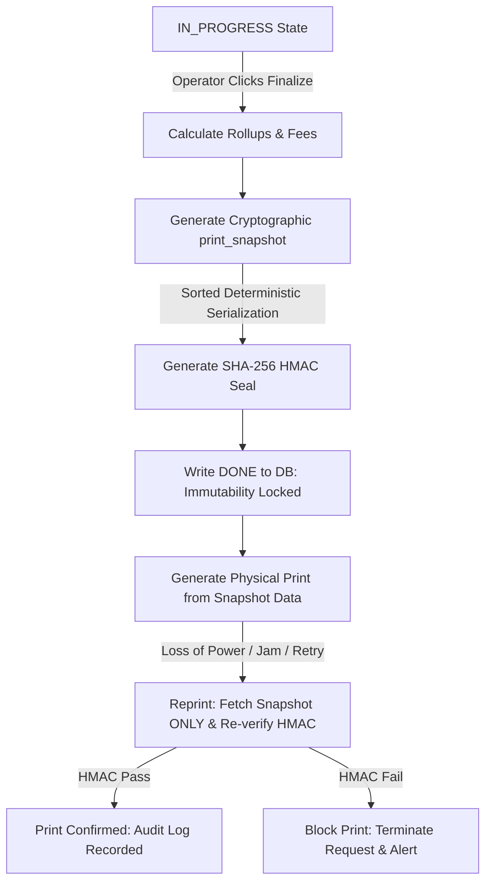
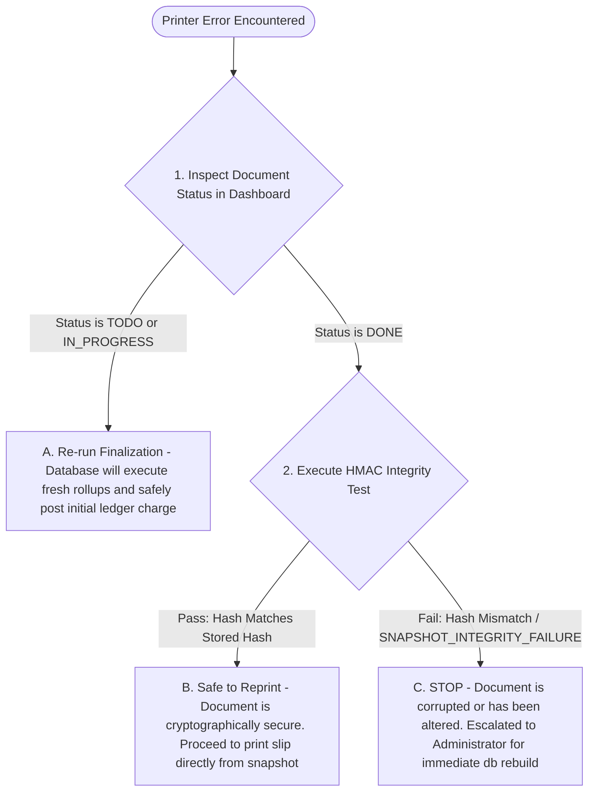

# Print Recovery Evidence (Physical Workflow Continuity & Verification)

This policy governs the **Physical Workflow Continuity Domain of Truth** for Swastik Gold & Silver Lab. It bridges the gap between digital cryptographic guarantees (HMAC-SHA256 signatures, stable serialization) and the real-world operational realities of physical paper printing (thermal slips, A4 certs). 

Physical print output is the final representation of our system's truth handed to the customer. If the physical print workflow fails under operational stress (e.g., printer jams, power outages, offline connection dropouts), the integrity of our terminal state must remain bulletproof, defensible, and traceably recoverable.

---

## 1. The Physical-to-Digital Trust Boundary

The transition from a digital database row to a physical sheet of paper introduces vulnerability. To make physical prints legally defensible and resilient against reprint tampering, the system enforces three core digital-to-physical invariants:

### 1.1. supreme Snapshot Authority
*   **The Invariant:** For any record in a finalized `DONE` state, the `print_snapshot` is the supreme authority for rendering. Live rows are ignored.
*   **The Guard:** Once a certificate transitions to `DONE`, all subsequent print requests are served **strictly** from the static, serialized `print_snapshot` envelope. 
*   **Tamper Prevention:** If a customer's name is corrected or an item is soft-deleted *after* finalization, the historic print output remains unchanged. This prevents **reprint drift** (where subsequent database changes retroactively alter historically issued certificates).

### 1.2. Cryptographic HMAC Sealing
*   **The Invariant:** Every print layout must have a valid cryptographic signature (`snapshot_hash`) generated using SHA-256 and the server-configured `SNAPSHOT_SECRET` key.
*   **The Guard:** The signature covers all critical structural elements: the schema version, generation timestamps, customer references, item gross weights (3 decimal places), purity values, and final tax/total rollups.
*   **Timing Attack Prevention:** During reprint validation, the system calculates the HMAC of the stored snapshot and compares it with the stored hash using `crypto.timingSafeEqual` to prevent timing-oracle attacks.

### 1.3. Version Guard & Downgrade Prevention
*   **The Invariant:** Snapshot envelopes contain strict version metadata (`version`, `schema_version`, `serialization_version`) that must not exceed maximum server parameters.
*   **The Guard:** If a snapshot's version fields exceed the running server's configured limits, reprint requests are rejected as database corruption errors to prevent rollback or serialization format attacks.

---

## 2. Physical Failure Modes & Recovery Workflows (Stress Matrix)

Operational stress manifests as physical failures. Below is the official governance matrix detailing how the system prevents ledger duplicates, financial drift, and integrity losses under physical stress conditions.

| Physical Failure Mode | Direct Operational Risk | System Mitigation / Recovery Behavior | Recovery Action for Operator |
| :--- | :--- | :--- | :--- |
| **Printer Jam / Out of Paper**  *(Midway through printing a DONE certificate)* | Operator might try to re-click "Finalize", triggering duplicate ledger debit postings. | The record's state transitions to `DONE` **immediately** upon finalization. Any second attempt to finalize throws a `409: Certificate is immutable` error, preventing duplicate debits. | 1. Clear the paper jam. 2. Go to "Completed Queue". 3. Click **Reprint**. The system serves the verified snapshot with zero ledger impact. |
| **Local Client Network Disconnect**  *(Receipt request sent, but connection drops before print)* | Local caching of raw tables could result in printing incorrect or obsolete test values. | 1. Non-finalized records (`TODO`, `IN_PROGRESS`) are explicitly labeled as previews with `Cache-Control: no-store` to prevent stale client caching. 2. Finalized snapshots are served with `Cache-Control: public, max-age=31536000, immutable` headers, ensuring secure CDN/browser caching. | 1. Restore local connection. 2. Refresh print queue. 3. Verify the "Completed" status badge. 4. Trigger a clean reprint from the immutable cached snapshot. |
| **Server Power Outage**  *(Outage occurs precisely during finalization transaction)* | Orphaning: Cert is marked `DONE` but no ledger row is written, or ledger row is written but no snapshot is sealed. | The database finalization operation is wrapped in a strict atomic transaction (`withTransaction` scope). Rollup, fee compilation, ledger entry, weight-loss logging, snapshot sealing, and state mutation are executed together. | 1. Boot up server. 2. Retrieve the record ID. 3. If transaction rolled back: The record remains in `IN_PROGRESS` (outstanding drafts list). Re-trigger finalization. 4. If transaction committed: The record is fully `DONE` with a secure HMAC seal. Print normally. |
| **URL Parameter Tampering**  *(Operator or client alters URL ID to bypass paywalls)* | Unauthorized printing or loading of gold certificate layout using a silver certificate's ID. | The verification engine (`validateAndExtract`) maps the database `entity_type` and `metal_type` headers inside the sealed snapshot. If the requested URL route segment does not match the snapshot header, the system throws a `Route/type mismatch` block. | 1. Never manipulate address parameters. 2. Print only using the dashboard's dedicated print buttons. |

---

## 3. Physical Print Recovery Checklist

When a physical print operation fails midway, operators must follow this step-by-step verification procedure:

### Operational Steps:
1.  **Do NOT attempt to re-create the certificate or test.** Re-creating a completed job creates transaction duplicates and breaks continuous sequence requirements.
2.  **Verify Status:** Check the dashboard status badge for the job:
    *   If it is **Completed (DONE)**, proceed to Step 3.
    *   If it is **Tested (IN_PROGRESS)**, re-submit the finalization action. The transaction will safely complete.
3.  **Validate Cryptography:** Click **Verify Reprint** in the administrative panel. The system will perform an inline HMAC verify (`validateAndExtract`):
    *   **PASS:** The system outputs: `Integrity verified: 100% Secure`. Click **Print Receipt**.
    *   **FAIL:** The system throws: `SNAPSHOT_INTEGRITY_FAILURE`. Stop immediately, lock customer transaction capabilities, and alert the Administrator.

---

## 4. Reprint Logs & Forensic Audit

Reprinting is a high-security action. Every reprint trigger is logged in `audit_logs` and contains the following forensic metadata:

*   **correlation_id / request_id:** The unique trace ID linking the request to the specific web process.
*   **action:** Set to `'PRINT_TRIGGERED'` for trace filtering.
*   **operation:** Set to `'printRoutes.getSnapshot'` to identify the entry point.
*   **entityType:** The specific table name (`gold_certificate`, `silver_certificate`, `photo_certificate`, etc.).
*   **entityId:** The canonical ID of the document (`GCR-...`, `SCR-...`, `PCR-...`).
*   **metadata:**
    *   `snapshot_hash`: The SHA-256 HMAC of the document printed.
    *   `snapshot_key_version`: The key version (e.g., `'v1'`) used to sign the data.
    *   `user_agent`: Browser identity of the printing terminal.
    *   `ip_address`: Network IP of the printing terminal.

This forensic data ensures that if a duplicate physical certificate is used for fraudulent double-pickup of metal or disputed payouts, management can identify who printed it, when, and from which machine.

---

## 5. Business Sign-Off & Physical Parity Questions

Before this physical continuity layer is certified for production operations, management must align on the following physical stress realities:

| Physical Operational Reality | Verification / Review Question | Business Sign-off (Yes/No) |
| :--- | :--- | :--- |
| **Immutable Slips on Printer Jam** | Do you accept that if the physical printer jams, you cannot edit the certificate details, and your only recovery is printing the exact cached print snapshot? | |
| **No Backdating Prints** | Do you accept that print snapshots capture the exact server-timestamp of completion, and backdating is strictly blocked to maintain ledger stability? | |
| **Automatic Reprint Logs** | Do you agree that every reprint event will trigger a mandatory, non-deletable audit log containing the terminal's IP and User Agent? | |
| **Downgrade Rejection** | Do you accept that if a database restoration introduces a certificate signed with a newer schema version than the running server, reprint will be blocked until the server is updated? | |

> **Operational Continuity Declaration:** We certify that the physical print workflows, print recovery steps, and cryptographic reprint protections defined above align with our business operational requirements and governance mandates.
>
> **General Manager Signature:** \_\_\_\_\_\_\_\_\_\_\_\_\_\_\_\_\_\_\_\_\_\_\_\_\_  **Date:** \_\_\_\_\_\_\_\_\_\_\_\_\_\_\_\_\_\_\_\_
